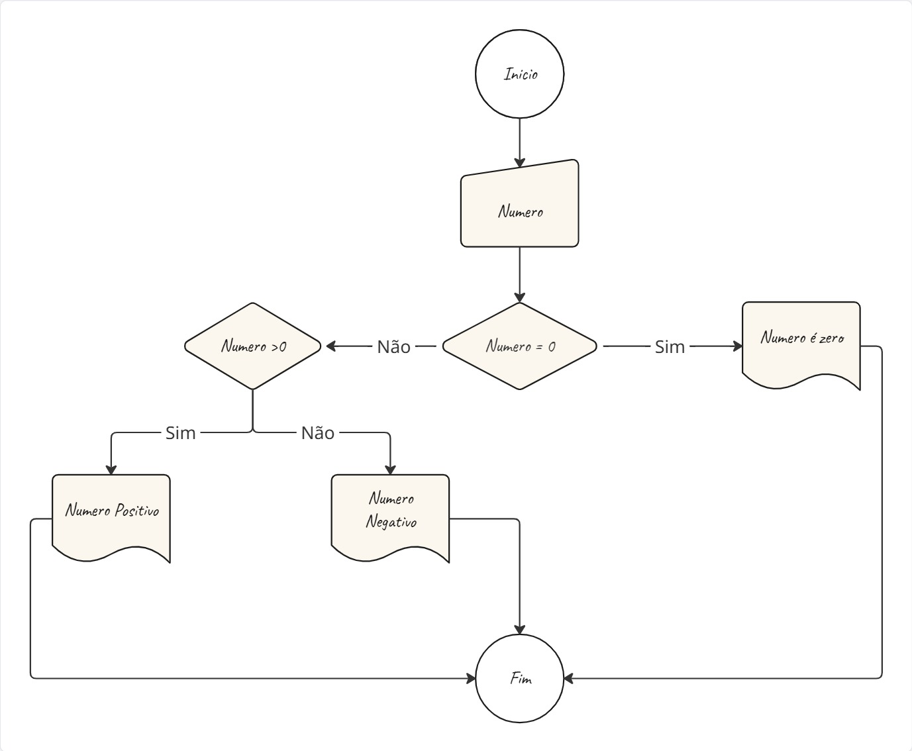
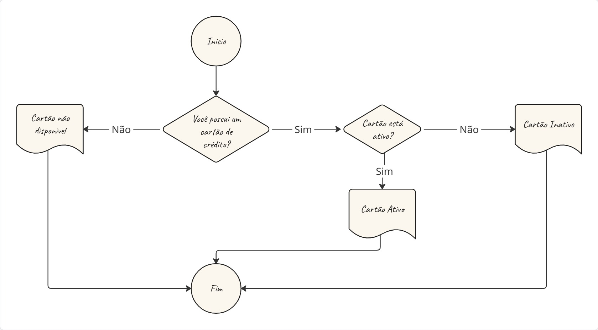

### A) Crie um fluxograma para o seguinte caso:

Verifique se um número fornecido pelo usuário é
positivo, negativo ou zero. Se o número for
positivo, exiba a mensagem "Número positivo".
Se o número for negativo, exiba a mensagem
"Número negativo". Caso o número seja zero,
exiba a mensagem "Número é zero".

**Resposta:**
    

### B) Crie um fluxograma para o seguinte caso:

Pergunte ao usuário se ele possui um cartão de
crédito. Se a resposta for "sim", verifique se o
cartão está ativo. Se estiver ativo, informe
"Cartão ativo". Se não estiver ativo, informe
"Cartão inativo". Se a resposta inicial for "não",
informe "Cartão não disponível".

**Resposta:**
  

### C) Crie um fluxograma para o seguinte caso:

Receba a entrada de um usuário sobre a
temperatura em graus Celsius. Se a temperatura
estiver abaixo de 0°C, informe "Congelante". Se
estiver entre 0°C e 25°C, informe "Frio". Se estiver
acima de 25°C, informe "Quente".

**Resposta:**
