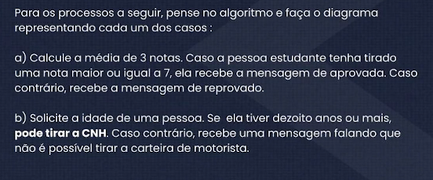

#### Questões:

#### Fluxograma: média das notas
Fluxograma onde é analisado se a nota do usuário é maior ou igual a 7.

#### Fluxograma: É possivel tirar CNH?
Fluxograma onde é analisado se usuario é maior de idade para tirar a CNH.

