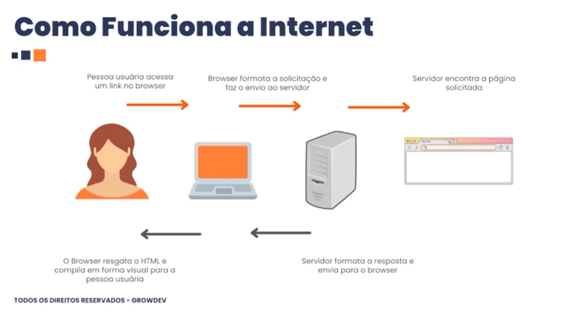
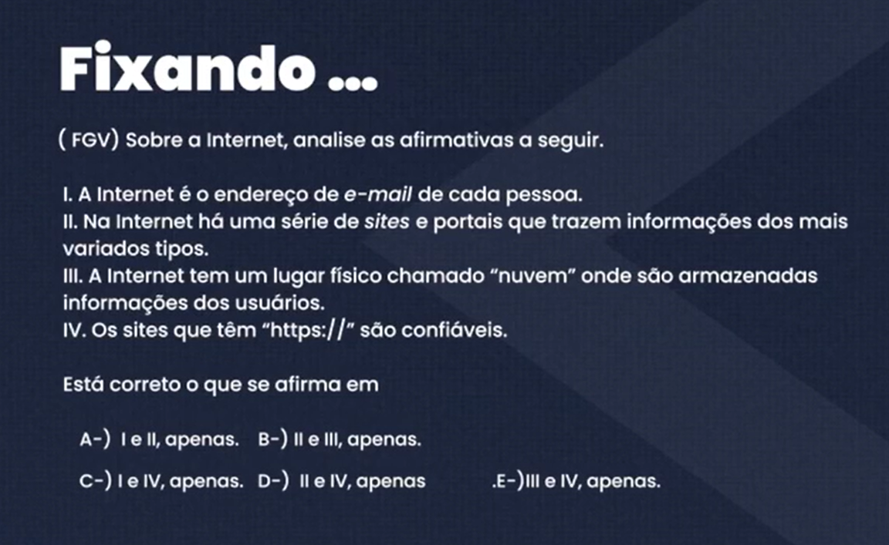

# Transmitindo informações

Cabos de fibra ótica que passam pelos oceanos.

- Alta velocidada.
- Grande Capacidade.
- Confiabilidade.
- Segurança

---

# Sinais - Modem e Rooteador

- Modem.
  - O modem traz a internet para sua casa, convertendo sinal da operadora em dados digitais.
- Roteador.
  - Pega essa conexão e faz a distribuição por WI-FI ou cabo para vários dispositivos (celulares, PCs, TVs), Criando sua rede local

  ---
  

  Resposta: D