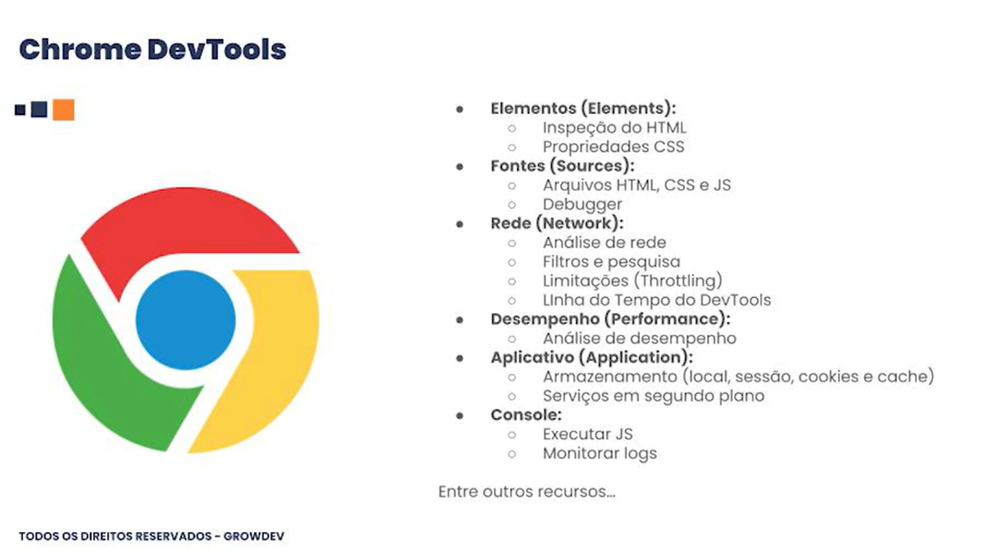

# Navegadores
Navegadores de internet (ou browsers) são programas/aplicativos que você instala no seu computador ou celular para acessar e visualizar conteúdos da web, como sites, imagens e vídeos, traduzindo o código das páginas (HTML) em algo que você entende graficamente.

--- 
# Chrome DevTools

