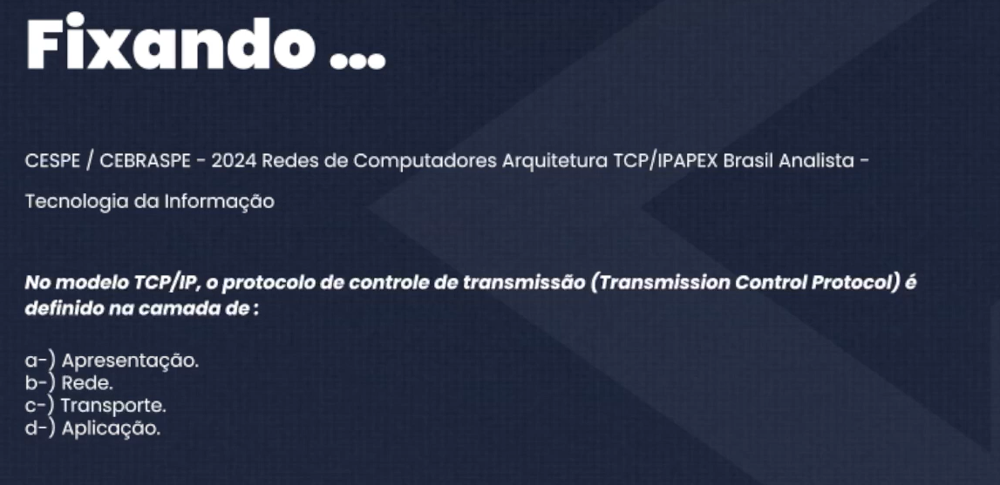

# TCP/IP
O TCP/IP (Transmission Control Protocol/Internet Protocol) é o
conjunto de protocolos fundamental para a comunicação na
Internet e em redes locais. Ele define como os dados são
formatados, endereçados, transmitidos, roteados e recebidos na
rede.

- Conjunto de protocolos.
- Transferência de dados.
- Quebrar as mensagems em pacotes.
- Padroniza a comunicação.

---

# IP

Tem a função de indentificar os nós (ponto conectado á rede).
Ao concetar, recebe uma identificação (Endereço de IP).

Resposta: C