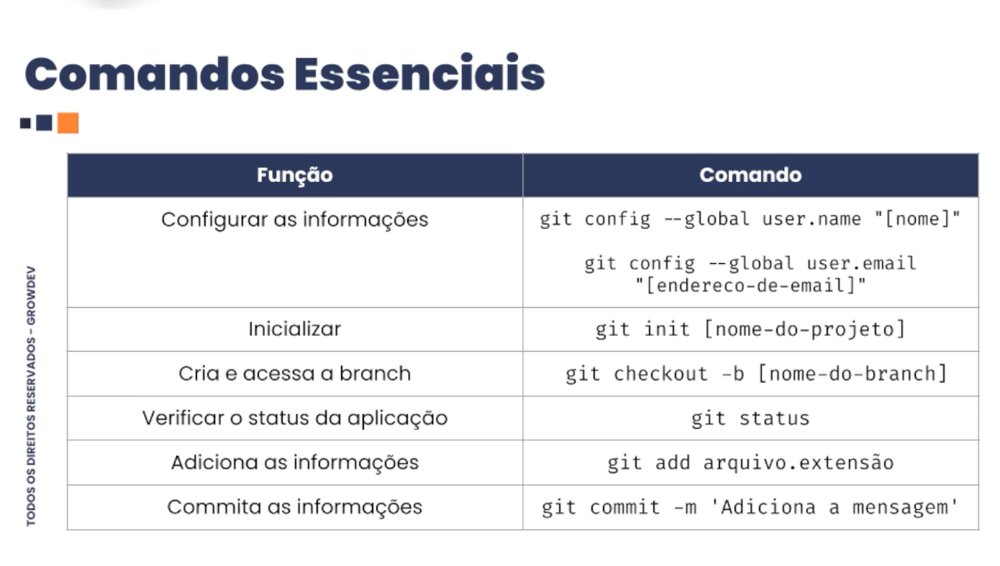

# Controle de versão

O Git foi criado por Linus Torvalds em 2005, para gerenciar o desenvolvimento do kernel Linux após um desentendimento com a ferramenta BitKeeper, tornando-se um sistema de controle de versão distribuído (DVCS) open source, rápido, eficiente e focado na colaboração, revolucionando o versionamento de software com sua estrutura de ramificação e marcação, e se tornando o padrão da indústria. 

----

Permite que você reverta para estado anterior determinados arquivos ou um projeto inteiro.

se você estragar tudo ou perder arquivos, você pode facilmente recuperar.

