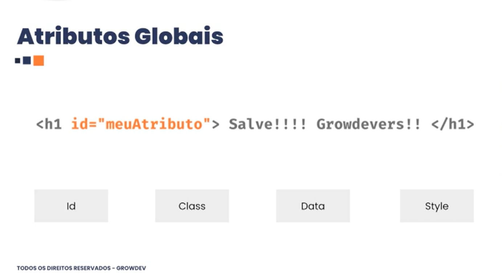
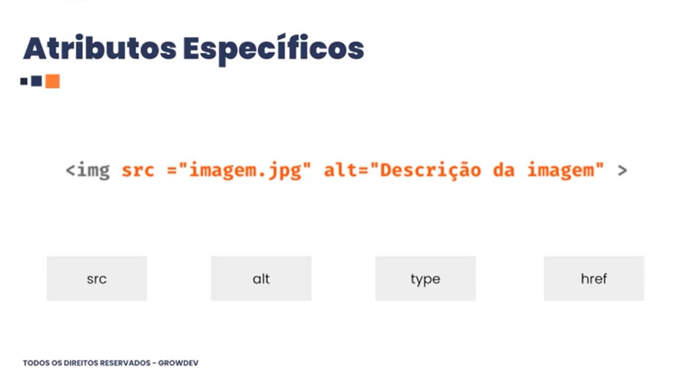
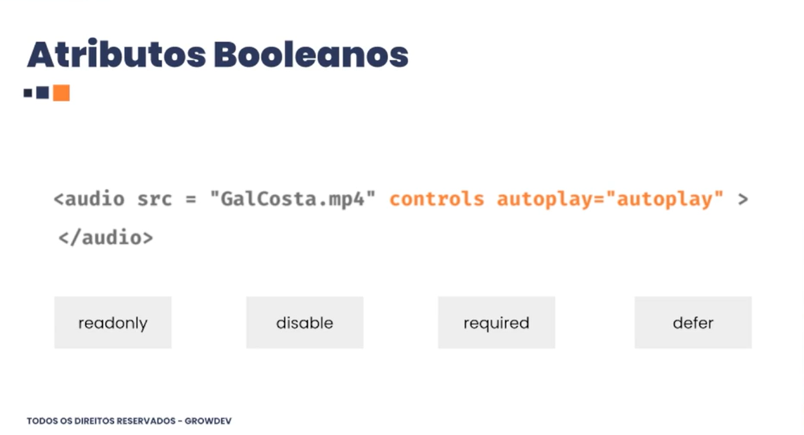

# Atributos

Atributos HTML são palavras especiais dentro da tag de abertura que modificam ou adicionam informações sobre um elemento, controlando seu comportamento ou funcionalidade

---

### Atributos Globais

- id
  - Identificador único de uma tag
- class 
  - Identificador geral onde posso identificar multiplas tags.

---

### Atributos Específicos

- src e alt é um atributo especifico da tag img.

---

### Atributos Booleanos
booleano = falso ou verdadeiro

- required
  - atributo booleano, ou seja esse atributo é obrigatorio o que seria true.