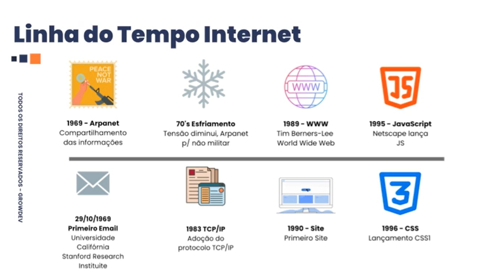

# HTML - Fundamentos da web
----

- HTML
  - Hyper Text Markup Language
  - é a linguagem padrão usada para criar a estrutura e o conteúdo das páginas da web, definindo elementos como textos, imagens, links e tabelas, funcionando como o esqueleto de um site para que navegadores possam interpretá-lo e exibi-lo corretamente. 
- CSS
  - Cascading Style Sheets
  - é uma linguagem usada para estilizar e formatar páginas web, controlando aparência visual como cores, fontes, layouts e espaçamentos, separando o conteúdo (HTML) da sua apresentação, o que torna os sites mais organizados e fáceis de manter. 
- Javascript
   - é uma linguagem de programação versátil que adiciona interatividade e comportamento dinâmico a sites, controlando elementos de página, atualizando conteúdo, criando gráficos e animações, e rodando não só no navegador, mas também em servidores (Node.js) e aplicativos móveis, sendo fundamental para o desenvolvimento web moderno e permitindo aplicações complexas e ricas em funcionalidades. 

----

# Web Site x Aplicações Web

- Web Site
  - Menos interatividade
  - Mais estático
- Aplicação Web
  - Mais robusta
  - Mais interatividade.